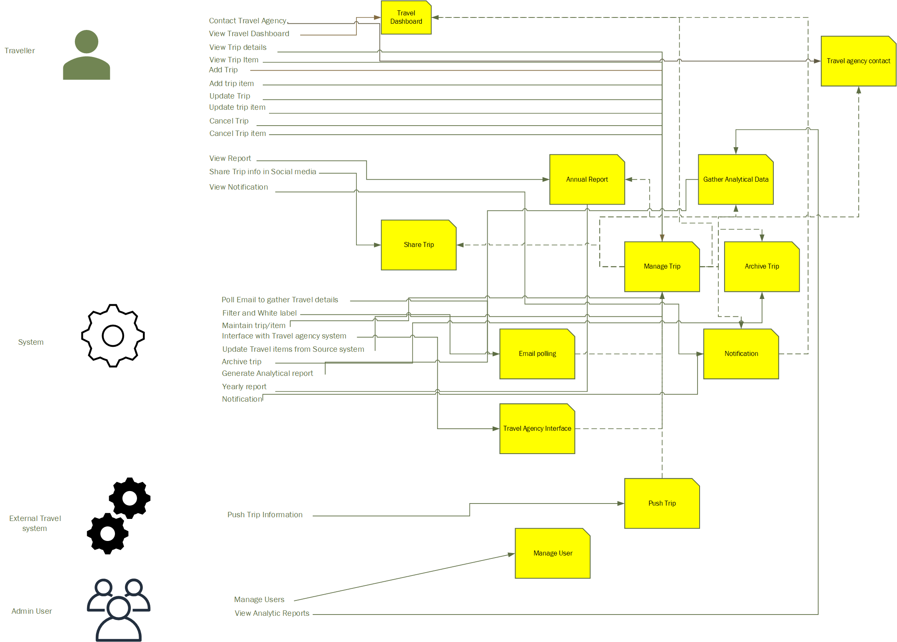

## Actor / Action Approach

After our brainstorming, we followed the actor/action approach to identify the actors of the System and their corresponding actions.

From that, we derived the basic building blocks of the System. 

Here is how our actor/action diagram look like:

[Previous Page](./Brain-Storming.md) | [Next Page](./Actor-Action-Approach.md)