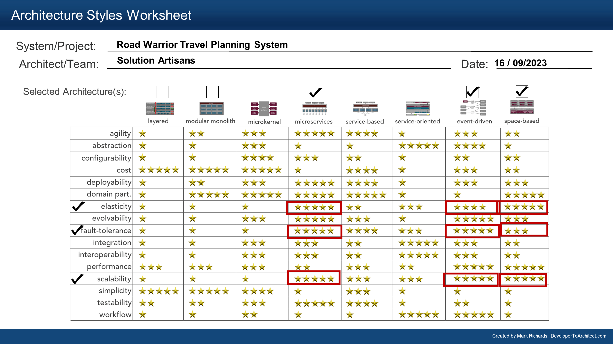

# Architecture Analysis

## Key Non-functional Properties
In this section we describe the key non-functional properties of the architecture.

#### Availability and Fault-tolerance
The System requires an availability of 99.99%.

Evidently, availability is of paramount importance for the system.

#### Scalability
The System at current state should support 2 million active users/week 
Total users in the system is 15 million.
The user adoption should increase in near future making scalability one of the key matrix for the system.

#### Elasticity

The load on the system won't be uniform at all the time.
For example during peak holiday season, the load will increase many fold.
Thus Elasticity is a key requirement for the system.

## Additional Considerations
#### Usability

The system needs to provide rich user experience to users as well as making it extremely simple to navigate. Thus usability becomes one of the key matrix for the system..

#### Performance

The Traveller dashboard should be extremely fast.
The mobile application has a fast content paint of less than 1.4 seconds and the web application should respond within 800ms.

### Security

The system works with the personal data of the user. Hence, security is of paramount importance.
The system also interacts with multiple external systems. All the integration points need to be secured in order to protect the system.
 

## Architecture Styles
Using the analysis of the key non-functional properties above and with the help of  the [worksheet](https://www.developertoarchitect.com/downloads/architecture-styles-worksheet.pdf), we compared a few styles and finalized one that will give us the most benefits with respect to the non-functional properties above. 

As shown in the table, Microservices, Service-based and event-based architectures were the most suitable candidates. 
We selected both the styles for this application

The detailed choice of Microservices architecture is documented in [ADR: MICROARCH](../ADRs/MICROARCH.md).

[Previous Page](./Actor-Action-Approach.md) | [Next Page](./C4.md)
