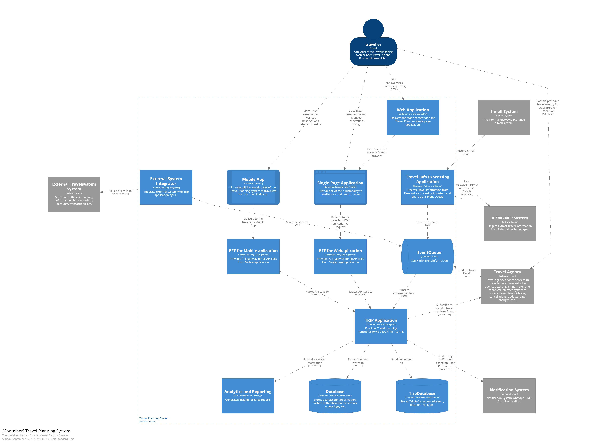

## The Container Diagram

This diagram breaks down the Road Warrior application into multiple services and technical components. 
For each of the components, we define the functionality, the technology being used and the inteaction with other components

Here we define some of the components:
- The application has a Single Page application as well as a Mobile App that work as the frontend of the application.
- The API Gateways work as the Back end for frontend.
- The TRIP Application is the main service of the application which exposes the APIs to be consumed.
- The Travel Info Processing service polls the emails, using AI/ML/NLP converts them to a system recognised format and pushes them to an event queue.
- The event queue also interacts with the Travel Agencies and External Travel Systems.
- The TRIP application consumes the events from the queue and creates and updates trips accordingly.
- The Analytics and Reporting component creates insights and generates reports.

[Previous Page](./ContextDiagram.md) | [Next Page](./ComponentDiagram.md)