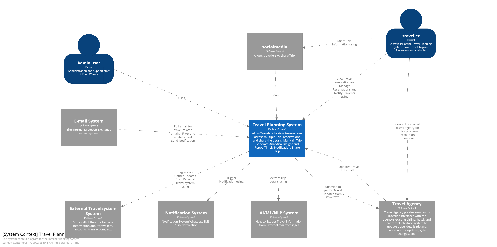

## The Context Diagram

This diagram defines the System as a blackbox along with the Actors and the external systems.

Here is how the Context Diagram look like:

[Previous Page](./C4.md) | [Next Page](./ContainerDiagram.md)